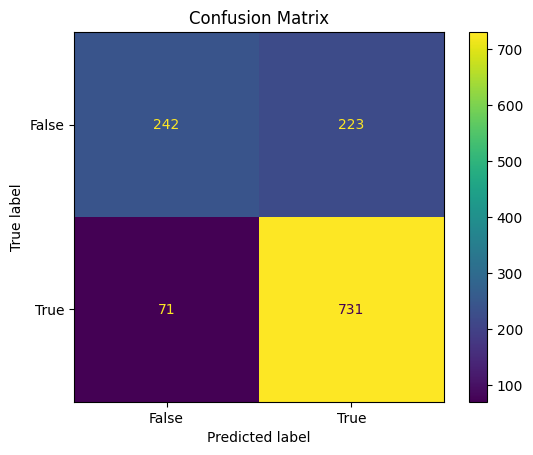

# EMG Model of Movement Detection

## 1) Intuito do projeto
Este projeto implementa um pipeline para detectar os instantes de início e fim de movimentos em sinais de EMG (eletromiografia) usando um classificador Random Forest. A ideia é extrair janelas de características a partir dos sinais, alimentar o classificador e produzir predições por janela que indicam quando um movimento começa e termina.

Os dados usados aqui foram coletados em uma pesquisa aplicada voltada a pacientes com ELA (esclerose lateral amiotrófica). O estudo foi conduzido pela mestre e doutoranda em fisioterapia pela Universidade Federal do Rio Grande do Norte (UFRN), Bruna Ribeiro Pinheiro Carneio de Sousa Pinheiro. Cada paciente foi avaliado em três momentos principais:
- PRE (antes do tratamento)
- POS1 (após a primeira intervenção)
- POS2 (após a segunda intervenção)

O objetivo da pesquisa é observar a evolução dos pacientes com o tratamento ao longo desses momentos. Este repositório contém o código para pré-processamento, extração de características, treinamento de um Random Forest e geração de predições (gráficos e arquivos de tempo) para inspeção e análise.

O código foi desenvolvido por José Augusto Agripino de Oliveira, mestrando em Engenharia Elétrica e de Computação pela UFRN.


## 2) Treinamento do modelo (Opcional e não recomendado)
> Aviso: para treinar o modelo você precisa de todos os dados de entrada (arquivos de movimentos e/ou features extraídas). Sem os dados completos, o treinamento não será possível. **Esta etapa não é recomendada**, uma vez que o modelo treinado já está disponível neste repositório (`~/rf_model.pkl`).

O script de treinamento é:

- `src/model_training.py`

Passos resumidos para treinar:
1. Instale as dependências do projeto:

```bash
pip install -r requirements.txt
```

2. Coloque seus dados na estrutura esperada (veja seção abaixo).
3. Execute o script de treinamento:

```bash
python src/model_training.py
```

Após o treinamento, o modelo (por padrão) é salvo como `rf_model.pkl` na pasta `data` do projeto.

Caso ache melhor, você pode usar o Docker para treinar o modelo. Para isso, siga os passos presentes na seção 4 e mude apenas o script no passo 5.

O modelo alcançou as seguintes acurácias:

```
accuracy on the validation set: 0.7622432859399684
accuracy on the test set: 0.7679558011049724
```

Como matriz de confusão, foi gerada:




## 3) Predição interativa (uso principal)
O código foi otimizado para gerar predições de forma interativa quando um modelo treinado já estiver disponível. O fluxo principal de predição está em:

- `src/main.py`

Funcionalidades principais:
- Modo interativo (padrão): permite executar múltiplas predições sem reiniciar o processo.
- Modo não-interativo: `--once` para executar uma única predição (útil dentro de containers).
- Os resultados são salvos em `assets/<patient_name>/<stage>/<movement>` (imagens e arquivos de tempos de movimento).

Exemplo de execução interativa (local):

```bash
python src/main.py
```

Exemplo não-interativo (uma execução):

```bash
python src/main.py --once --patient P4
```

ou

```bash
python src/main.py --once -p P4
```


## 4) Como executar com Docker (forma recomendada)
### Docker
Recomenda-se usar Docker para isolar dependências e garantir reprodutibilidade. Docker Desktop pode ser obtido em:

- https://www.docker.com/products/docker-desktop/

Há também um vídeo-tutorial de instalação disponível em:

- https://youtu.be/T_-ehcw2h-g?si=w2X_8mL_9QCxrfSb

Com Docker instalado, os passos para rodar o programa são:

1. Clonar o projeto e entrar nele (procure por "terminal" na pesquisa do windows):

```bash
git clone git@github.com:AugustoOliveira099/emg-model-of-motion-detection.git
cd emg-model-of-motion-detection
```

2. Build da imagem:

```bash
docker compose build
```

3. Rodar os serviços:

```bash
docker compose up -d
```

4. Logo em seguida, abra o terminal no container criado com o comando abaixo:

```bash
docker exec -it emg-container bash
```

5. Em seguida, escolha entre o passo 5 e o passo 6. Execute o comando a seguir para usar o programa no modo iterativo:

```bash
python src/main.py
```

6. Como forma alternativa ao passo 5, você pode rodar uma única predição sem entrar no modo interativo (útil em pipelines ou jobs):

```bash
python src/main.py --once --patient P1 --stage POS1 --movement P1_alcancarbola_POS1
```

7. Quando quiser parar, pressione `Ctrl+C` OU aperte `q` e depois `Enter`.

8. Para você conseguir voltar ao seu terminal e sair do terminal do container, basta executar:

```bash
exit
```

9. Antes de parar de usar a aplicação, pare os serviços:

```bash
docker compose down
```

Os resultados (gráficos e arquivos de tempos) serão gerados em `assets/<patient_name>/<stage>/<movement>/`.


## Estrutura esperada dos dados (pasta `data/patients`)
A organização de entrada esperada é a seguinte. Cada paciente tem uma pasta, cada pasta contém subpastas para os estágios (PRE, POS1, POS2, etc.) e dentro de cada estágio ficam os arquivos de movimento (CSV):

```
data/patients/
	├─ P1/
	│   ├─ PRE/
	│   │   ├─ P1_alcancarbola_PRE.csv
	│   │   └─ P1_mov2_PRE.csv
	│   ├─ POS1/
	│   │   ├─  P1_alcancarbola_POS1.csv
	|	|	└─ P1_mov2_POS1.csv
	│   └─ POS2/
	│       ├─ P1_alcancarbola_POS2.csv
	|		└─ P1_mov2_POS2.csv
	└─ P2/
			└─ PRE/
					└─ P2_mov1_PRE.csv
```

Observação importante:
- Se os arquivos CSV vierem sem cabeçalho, há um arquivo `data/cabecalho.csv` com a lista das labels que é aplicada automaticamente usando o método `Patient.add_header()` (arquivo em `src/utils/patient.py`). A função agora é idempotente e detecta quando o header já foi aplicado (ou está como primeira linha) e evita duplicações.
